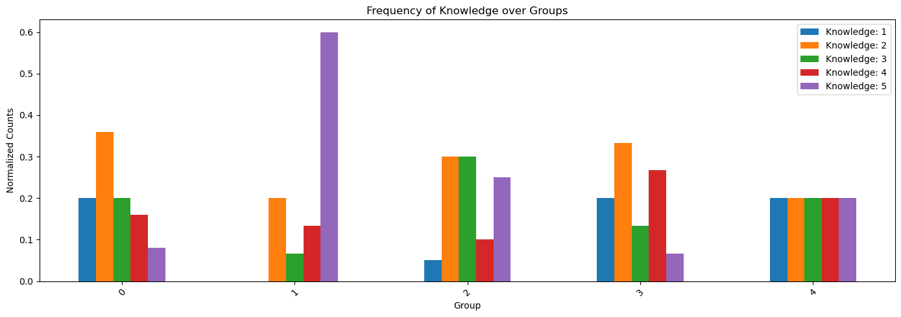

# Short Answer Plagiarism Detection
Our group has been tasked to conduct a similarity study to detect
possible plagiarism between short answers. A set of five short answer
questions (AE) on a variety of topics that might be included in the
Computer Science curriculum were created by the authors. For each of
these questions a set of answers were obtained using a variety of
approaches, some of which simulate cases in which the answer is
plagiarised and others that simulate the case in which the answer is not
plagiarised. In addition, 5 additional short answers were given: this
additional answers were directly taken from Wikipedia and thus served as
a groundtruth with respect to wich the plagairism has to be detected. We
were given with:

-   $100$ documents, among which:

    -   $95$ were answers answers provided by the 19 participants

    -   $5$ were Wikipedia source articles

-   an `EXCEL` file which, for each answer of each participant, gives
    information regarding the participant itself (i.e. Level of
    Knowledge, How Difficult a Question was perceived, if Native Speaker
    or not) and the level of plagiarism of each answer w.r.t. the
    Wikipedia source article. This file serves as ground truth to test
    our model accuracy. We will focus more on this file later, in
    Section [2](#sec:1)

We were tasked to use python and additional libraries to address the
following points:

-   Data exploration and description

-   Pre-processing the data

-   Use one duplicate detection algorithm to identify duplicate
    documents

-   Test the accuracy of the model using the test data

## Data Exploration and Description 

### First Insights

The first step we made towards describing and analyizing the dataset,
was to explore and understand the `EXCEL` file. This file is structured
as follows:
| File             | Group | Person | Task | Category | Native English | Knowledge | Difficulty |
|------------------|-------|--------|------|----------|----------------|-----------|------------|
| g0pA_taska.txt   | 0     | A      | a    | non      | native         | 1         | 1          |
| g0pA_taskb.txt   | 0     | A      | b    | cut      | native         | 4         | 3          |
| ...              | ...   | ...    | ...  | ...      | ...            | ...       | ...        |
| g4pE_taske.txt   | 4     | E      | e    | non      | non-native     | 4         | 5          |

From this file we can extract the following useful information:

-   There are $5$ groups, s.t.:

    -   `group 0` contains $5$ persons

    -   `group 1` contains $3$ persons

    -   `group 2` contains $4$ persons

    -   `group 3` contains $3$ persons

    -   `group 4` contains $4$ persons

-   There are 4 category of plagiarism w.r.t. to Wikipedia Source
    Articles:

    -   `non` which stands for no plagiarism

    -   `cut` which means the answer is a cut version of the wikipedia
        source article

    -   `light` which stands for light plagiarism

    -   `heavy` which stands for high plagiarism

-   There are 5 tasks:

    -   `a`: What is inheritance in object oriented programming?

    -   `b`: Explain the PageRank algorithm that is used by the Google
        search engine.

    -   `c`: Explain the vector space model for Information Retrieval.

    -   `d`: Explain Bayes Theorem from probability theory.

    -   `e`: What is dynamic programming?

-   For each task, each participants tells his level of Knowledge w.r.t.
    the topic of the question and how difficult the question was for
    him. Both of this insights (i.e. level of Difficulty and level of
    Knowledge) are on a scale from $1$ to $5$.  We also get to know if
    the participant was Native speaker or not.

It is important to notice that each participant is identified by a group
and a letter, and each document (i.e. short answer) is identified by the
participant ID (group and letter) and by the task.

## Data Visualization
 

At first, we focused on visualizing and exploring the `Excel` file
labels. Given the task, the initial basic visualization was to compute a
piechart of the plagiarism labels, to see how evenly distributed they
were.

#### Distribution over Groups

Our first assumption to investigate was looking for any interesting
relationship between a certain group and certain values *(n.w. From now
on with 'values' we refer to the column names of the excel file)*. The
result that encouraged us to perform this kind of analysis was that, as
shown in [2](#fig:image2),
the distribution of native and non-native speaker among each group is
not uniform: we find two groups with native speakers only, one with
non-native speakers only and two with a mixture of native and
non-native. We therefore wanted to check if the eterogeneous composition
of a group (i.e. Knowledge and Nationality) could be linked to some
levels of plagiarism or Difficulty. Thus, we focused on further
investigating different distribution of values among groups. As you can
see in [5](#fig:group-of-images), we wanted to see how Knowledge,
Difficulty and Plagiarism Categories where distributed over groups. All
the plot you see are normalized w.r.t. the number of components of the
group. As a matter of example, we can note that members of group 2
tended to describe themselves as high knowledgeable, while in the
distribution of Difficulty they seem to not be the ones who found tasks
more easy. We wanted to further investigate if the composition of a
group and the distribution of its values could influence the plagiarism
distribution, but then we noticed that the distribution of categories
over groups were equally distributed. By looking at
[1](#fig:image1), we notice
that for each group, the distribution of categories is actually the
same. This plot shows, for each group, the plagiarism level of its
participant's answers. As we can see, all categories are equally
distributed, and this lead to the conclusion that there was an
insignificant correlation between a certain group participants' values,
and the level of plagiarism.

<figure id="fig:group-of-images">
<figure id="fig:image1">

<figcaption>Distribution of plagiarism categories over
groups</figcaption>
</figure>
<figure id="fig:image2">

<figcaption>Distribution of native language over groups</figcaption>
</figure>
<figure id="fig:image3">

<figcaption>Distribution of Knowledge over groups</figcaption>
</figure>
<figure id="fig:image4">

<figcaption>Distribution of Difficulty over groups</figcaption>
</figure>
</figure>

### Correlation Plot 

With the aforementioned discovery, we head to computing a correlation
plot to understand if plagiarism could instead be linked to individual
carachteristics. As is visible in [6](#fig:corr){reference-type="ref"
reference="fig:corr"}, the correlations in the matrix are mostly weak,
indicating little linear relationship between the variables. Please note
that the underscore means that literal labels where transformed into
numerical, to be able to include them in the correlation plot. However,
there are some noteworthy correlations, such as the moderate negative
correlation between `Native English_` and `Difficulty`, and the moderate
positive correlation between `Knowledge` and `Difficulty`. There is a
positive correlation (0.18), indicating a slight tendency for certain
categories to be associated with higher levels of difficulty.
Specifically, categories labeled as \"heavy\" (coded as 1) tend to have
higher difficulty levels, as indicated by the positive correlation
coefficient. This low values of correlations, unfortunately, forced us
to deploy a model focused mainly on analyzing the text content of the
short answers, instead of considering also external indicators such as
Nationality, Difficulty and Native Language.

![[]{#fig:corr label="fig:corr"} Correlation Matrix of all
values](images/correlation.png){#fig:corr width="50%"}

### Text Analysis

Here we report a table that shows meaningful insights about the
composition of answers w.r.t. a certain topic. We focused on these
metrics because, given the above assumption in
[2.2.2](#subsec:corr){reference-type="ref" reference="subsec:corr"}, we
wanted to understand how to preprocess the textual data. By looking at
this table, we can see how the answers does not vary significantly in
terms of metrics, even between topics. Despite this general
consideration, we can still infer one relevant insight, i.e. that for
`task B` and `task E`, the deviation in length from the GroundTruth
source article, is pretty high. This may be inetrepreted as a higher
number of cuts or, in general, that the participants tended to give
short answers w.r.t. this topic. Also, the length of the answers (even
the longest ones), does not seem to be unbereable, and thus does not
require any trimming.

# Data Preprocessing

As stated above, we didn't apply any trimming over the text. Instead, we
focused in performing tokenization of the words in each text line. Since
we are focusing only on textual properties to predict the plagiarism, we
create a dataframe where, for each file path, we get only its task and
its Category (i.e. we discarded all other informations). Note that
categories are transformed into numbers, so that $0$ is no plagiarism,
$1$ is heavy, $2$ is light and $3$ is cut. Also, we add another column,
named `Class` which defines if a certain document is plagiarised (i.e.
heavy, light or cut) or not. After that, we add another column named
`Text` which contains the tokenized and spaced text of each document. At
first we removed all special charachters except spaces and dashes, then
we passed the cleaned textlines to Spacy tokenizer. Spacy provides a
pre-trained model which performs tokenization looking also at text
context and syntax. This allows for an effective tokenization otherwise
impossible with 'hard-coded' algorithms. Lastly, we add a column named
`Class` where we randomly apply labels `train` and `test` to every
non-original document, and `orig` to the original document. This random
splitting of the documents into training and testing is performed as
follows. At first we choose the subset of the dataframe containing all
documents with `class=0`, i.e. the non-original. Then we stratify this
subset by 'Task' and 'Category, i.e. we ensure that the subsets
(training and testing sets) are representative of the whole dataset.
This means that each subset contains the same proportion of each
category of the data as the original dataset. Instead, the documents
with `class=1`, i.e. the Wikipedia source article, are marked as `orig.`
Thus we end up with the following dataframe:

![[]{#fig:df1 label="fig:df1"} Dataframe of our
dataset](images/df_v1.png)

# Duplicate Detection Algorithm - Methodology

Our corpus is not unbearably large, given also that the answers, as
shown in
[\[tab:task_statistics\]](#tab:task_statistics){reference-type="ref"
reference="tab:task_statistics"}, remains in a reasonable amount of
characters. Thus, we do not aim to implement a pipline for LSH. This
said, we still need to adopt some similarity methods which are
computationally efficient and which are robust with respect to slight
modifications and changes in the sentence and word ordering. To detect
similar documents, we rely on the estimation of different measures:

-   **K-Shingling Similarity**: Compute shingles based on a given k. We
    choose k to range between $[3,6]$. To compute the k shingles, we
    used directly the tokenized textlines. By applying K-Shingling, we
    obtain, for each document, a set of the respective shingles. We then
    compute Jaccard Similarity on this shingles sets, i.e.
    `intersection / union`

-   **N-Grams Similarity**: We convert a collection of text documents to
    a matrix of token counts, where the tokens are the single words in
    this case. We are interested in n-grams of length $8$. The
    similarity is calculated by taking the minimum count of each n-gram
    across the two texts and summing these counts. This sum is then
    divided by the sum of n-gram counts in the first text. This means
    that we are computing the level of overlap of the n-grams between
    the two texts.

-   **MinHash Similarity**: We basically estimate the Jaccard Similarity
    between two documents using MinHash. Each document is processed one
    token at a time.

After applying these methods, we store in the datafrae the value
obtained. Now, we can tackle this classification task by using a
Decision Tree Model. A Decision Tree Model is a non-parametric algorithm
for supervised learning (i.e. it relies on targets). Decision tree
learning employs a divide and conquer strategy by conducting a greedy
search to identify the optimal split points within a tree. This
\"splitting process\" is then repeated in a top-down, recursive manner
until all, or the majority of records have been classified under
specific class labels. The main reason why we choose this type of model
are its Non-Parametricity (i.e. it makes no assumption on the
distribution of the data, given that our similarities may not follow any
known statistical distribution) and its ability to Handle different
Feature Type (i.e. we have different similarity values).

# Model Evaluation

We used the Decision Tree model to correctly classify:

-   The presence of plagiarism, i.e. the `Class`. This model was able to
    correctly predict the labels **`0:{no plagiarism}`** and
    **`1:{heavy, cut, light}`**, with an accuracy of $92 \%$.

      Class           Precision   Recall   F1-score   Support
      -------------- ----------- -------- ---------- ---------
      0                 0.83       1.00      0.91       10
      1                 1.00       0.87      0.93       15
      Accuracy                               0.92       25
      Macro avg         0.92       0.93      0.92       25
      Weighted avg      0.93       0.92      0.92       25

      : Classification report for Decision Tree on Class 0,1

    We were able to get a good accuracy for both classes, which, in
    other words, means that for class 0 we have $0.27$ false positives,
    while for class 1 we have none. Also recall is good. It measures the
    model's ability to capture the true positives. This means that the
    model was able to detect all true positives for class 0 and $87\%$
    of true positives for class 1.

-   The presence of which type of plagiarism, i.e. the `Categories`. For
    this task, the model is not performing as good as above, which means
    that it is difficult to find a correct separation between the three
    classes of plagiarism.While the model is able to detect a plagiarism
    of type `cut`, the main issue seems to be between class heavy and
    light. The overall accuracy of the model is 72%.

          Class       Precision   Recall   F1-score   Support
      -------------- ----------- -------- ---------- ---------
         0 - non        0.83       1.00      0.91       10
        1 - heavy       0.50       0.20      0.29        5
        2 - light       0.40       0.40      0.40        5
         3 - cut        0.83       1.00      0.91        5
         Accuracy                            0.72       25
        Macro avg       0.64       0.65      0.63       25
       Weighted avg     0.68       0.72      0.68       25

      : Classification report
    :::
